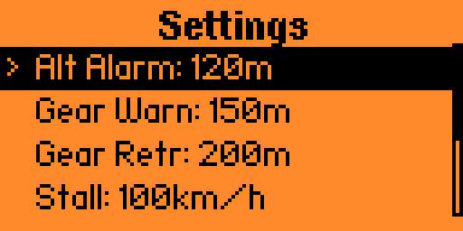
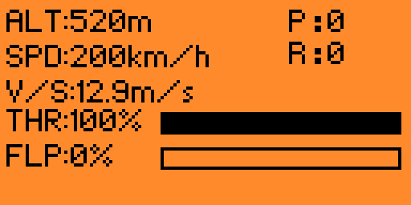

# ✈️ Flight Monitor - War Thunder Dashboard for Flipper Zero

<h2 align="center">Real-time Aircraft Parameters Monitor for Flipper Zero</h2>

<div align="center">
    
    
    
</div>

This is a **comprehensive flight monitoring application** designed for the **Flipper Zero** that interfaces with **War Thunder** flight simulator via **Bluetooth Low Energy (BLE)**. The application provides real-time display of critical flight parameters with an intelligent alarm system for enhanced flight safety.

## ✨ Features Overview

**🛩️ Flight Parameters Display**

The application provides accurate and real-time readings for complete flight telemetry:

* **Altitude (ALT):** Current height above ground in meters (**m**).
* **Speed (SPD):** Indicated Air Speed (IAS) or True Air Speed (TAS) in kilometers per hour (**km/h**).
* **Vertical Speed (V/S):** Rate of climb or descent in meters per second (**m/s**).
* **Throttle (THR):** Engine power setting from 0% to 100%.
* **Flaps (FLP):** Flaps deployment percentage from 0% to 100%.
* **Gear Status:** Landing gear position (UP/DOWN).
* **Pitch & Roll (P/R):** Aircraft orientation angles in degrees.

**🚨 Intelligent Alarm System**

Professional safety monitoring with configurable thresholds:

* **Altitude Warning:** Audible alarm when descending below configured altitude (default: 120m).
* **Gear Warning:** Alert when flying low with gear extended (default: below 150m).
* **Gear Retraction Alert:** Fullscreen warning to retract gear at speed (default: >200m at >150 km/h).
* **Stall Speed Warning:** Protection against dangerously low airspeeds (configurable).
* **Overspeed Warning:** Alert when exceeding safe speed limits (configurable).
* **Engine Failure Detection:** Automatic detection based on power loss + descent (power <100HP + falling + altitude >100m).
* **G-Force Alerts:** Vibration warnings for extreme pitch (>60°) or roll (>70°) at high speeds (>200 km/h).
* **Crash Detection:** Automatic alarm silence when aircraft data stops changing.
* **Gear Alarms Toggle:** Disable all gear warnings for fixed-gear aircraft.

**⚙️ User Interface & Experience**

* **Splash Screen:** 3-second startup logo with airplane graphic and branding.
* **Multiple View Modes:** Main dashboard, throttle view, flaps view, orientation view.
* **Settings Menu:** Configurable thresholds (altitude, gear warnings, stall speed, overspeed).
* **Persistent Configuration:** Settings saved to `/ext/apps_data/flight_monitor/settings.cfg`.
* **Visual Feedback:** Progress bars for throttle and flaps, status messages for connection state.
* **High Refresh Rate:** 100ms data update interval (10 Hz) for smooth operation.

**📡 Connectivity**

* **Bluetooth Low Energy (BLE):** Custom protocol for efficient data transmission.
* **Binary Data Format:** Compact 20-byte packets for minimal latency.
* **Auto-Discovery:** Python server automatically finds and connects to Flipper Zero.

## 🔧 Installation Guide

**Prerequisites**

* Flipper Zero with f7 firmware
* War Thunder game installed on PC
* Python 3.x installed on PC

**1. Compile and Install Flipper App**

Navigate to the flipperzero-firmware directory and compile:

```bash
./fbt COMPACT=1 DEBUG=0 launch APPSRC=applications_user/flight_monitor
```

Or manually copy the compiled `.fap` file from `build/f7-firmware-C/.extapps/flight_monitor.fap` to `/ext/apps/Bluetooth/` on your Flipper Zero.

**2. Set Up Python Server**

GUI Server (Recommended):

```bash
python flight_server_gui.py
```

Features: visual interface, IP config persistence, auto-start, **auto-dependency installation** (no manual pip install needed!).

Console Server:

```bash
python flight_server_clean.py
```

Both servers automatically install missing dependencies (`requests`, `bleak`) on first run.

**3. Enable War Thunder API**

1. Launch War Thunder
2. API is available at: `http://localhost:8111/state`
3. Verify in browser - you should see JSON data
4. Enter a battle to receive live flight data

## 🎮 Usage Instructions

**On Flipper Zero:**

1. Navigate to: **Apps → Bluetooth → Flight Monitor**
2. Splash screen shows for 3 seconds
3. Settings menu appears - configure thresholds or press **OK** on **START**
4. Status shows **"Waiting for data..."**

**On PC:**

1. Ensure War Thunder is running
2. Launch Python server
3. Server auto-installs dependencies and connects to Flipper
4. Watch status indicators for connection confirmation

**In-Game:**

1. Enter any Air Battle
2. Get into aircraft cockpit
3. Flight data appears on Flipper display!
4. Alarms activate based on your configured thresholds

## đź“Š Data Flow

```
┌──────────────┐         ┌───────────────┐         ┌──────────────┐
│  War Thunder │ ◄─HTTP─►│ Python Server │ ◄─BLE──►│ Flipper Zero │
│   localhost  │  JSON   │  (PC)         │ Binary  │  (Display)   │
│   :8111      │         │               │         │              │
└──────────────┘         └───────────────┘         └──────────────┘
     100ms polling           Processing               100ms refresh
```

## 🛠️ Technical Specifications

**Binary Protocol (20-byte packet):**

```c
struct __attribute__((packed)) FlightData {
    int16_t  altitude;       // meters
    uint16_t speed;          // km/h
    int8_t   vertical_speed; // m/s
    int16_t  throttle;       // 0-100
    int8_t   pitch;          // degrees
    int8_t   roll;           // degrees
    uint8_t  gear;           // 0=UP, 1=DOWN
    uint8_t  flaps;          // 0-100%
    int16_t  power;          // HP
    int16_t  fuel;           // kg
};
```

**BLE:**
* Service UUID: `8fe5b3d5-2e7f-4a98-2a48-7acc60fe0000`
* RX UUID: `19ed82ae-ed21-4c9d-4145-228e62fe0000`
* Device name: `"Flight XXXX"` (XXXX = last 4 MAC digits XOR 0x0003)

**Performance:**
* Refresh rate: 100ms (10 Hz)
* Data packet: 20 bytes
* Stack size: ~2 KB

## 🐛 Troubleshooting

* **Cannot connect to game** - Verify War Thunder is running, check `http://localhost:8111/state` in browser
* **Flipper Zero not found** - Ensure Flight Monitor app is running, check PC Bluetooth is enabled
* **Constant gear alarms** - Set "Gear Alarms: OFF" in settings menu (for fixed-gear aircraft)
* **Data not updating** - Make sure you're in flight (not hangar), restart Python server

## 👨‍💻 Author

**Dr.Mosfet** - Created for the War Thunder and Flipper Zero communities.

Based on PC Monitor by Olejka for BLE foundation.

## đź“ś License

MIT License - see LICENSE file for details.
